# 프리플랍 GTO 트리 수집 현황

자동 생성됨 — `python3 scripts/gto_tree_report.py`로 재생성.

⚠️ **"전체 대비 %"는 정의하지 않음** — 데이터 기반 수집 원칙상 트리 전체
규모를 미리 알 수 없다(`docs/gto-preflop-tree.md` 참고). 아래는 지금까지
**확정 수집(collected) / 발견됐지만 미수집(frontier) / 검증 실패(failed)**
3분류 현황이다.

## 요약

- ✅ **확정 수집**: 24개
- 🟡 **발견됨(미수집, 다음 후보)**: 21개
- 🔴 **검증 실패(재시도 대상)**: 0개

### 포지션별 확정 수집 (히어로 기준)

| 포지션 | 수집 수 |
|---|---|
| UTG | 2 |
| HJ | 2 |
| CO | 2 |
| BTN | 4 |
| SB | 6 |
| BB | 8 |

### 깊이별 확정 수집 (액션 수 기준, 0=RFI)

| 깊이(액션 수) | 수집 수 |
|---|---|
| 0 | 1 |
| 1 | 2 |
| 2 | 2 |
| 3 | 3 |
| 4 | 5 |
| 5 | 8 |
| 6 | 3 |

## 트리 다이어그램

초록=확정 수집 · 노랑=발견됨(미수집) · 빨강=검증 실패 · 회색 점선=조상 경로(자체는 미방문)

```mermaid
graph TD
    n0["ROOT"]
    n1["HJ RFI<br/><small>F</small>"]
    n2["HJ vs UTG open<br/><small>R2.5</small>"]
    n3["CO RFI<br/><small>F-F</small>"]
    n4["CO vs HJ open<br/><small>F-R2.5</small>"]
    n5["CO vs UTG open<br/><small>R2.5-C</small>"]
    n6["CO vs UTG open<br/><small>R2.5-F</small>"]
    n7["CO vs HJ 3bet<br/><small>R2.5-R8</small>"]
    n8["BTN RFI<br/><small>F-F-F</small>"]
    n9["BTN vs HJ open<br/><small>F-R2.5-C</small>"]
    n10["BTN vs HJ open<br/><small>F-R2.5-F</small>"]
    n11["BTN vs CO 3bet<br/><small>F-R2.5-R8</small>"]
    n12["BTN vs UTG open<br/><small>R2.5-F-F</small>"]
    n13["BTN vs HJ 3bet<br/><small>R2.5-R8-F</small>"]
    n14["SB RFI<br/><small>F-F-F-F</small>"]
    n15["SB vs BTN open<br/><small>F-F-F-R2.5</small>"]
    n16["SB vs HJ open<br/><small>F-R2.5-F-C</small>"]
    n17["SB vs HJ open<br/><small>F-R2.5-F-F</small>"]
    n18["SB vs BTN 3bet<br/><small>F-R2.5-F-R8</small>"]
    n19["SB vs CO 3bet<br/><small>F-R2.5-R8-F</small>"]
    n20["SB vs BTN 4bet<br/><small>F-R2.5-R8-R17.5</small>"]
    n21["SB vs UTG open<br/><small>R2.5-F-F-F</small>"]
    n22["SB vs HJ 3bet<br/><small>R2.5-R8-F-F</small>"]
    n23["BB RFI<br/><small>F-F-F-F-C</small>"]
    n24["BB vs SB open<br/><small>F-F-F-F-R3.5</small>"]
    n25["BB vs BTN open<br/><small>F-F-F-R2.5-C</small>"]
    n26["BB vs BTN open<br/><small>F-F-F-R2.5-F</small>"]
    n27["BB vs SB 3bet<br/><small>F-F-F-R2.5-R11</small>"]
    n28["BB vs HJ open<br/><small>F-R2.5-F-F-C</small>"]
    n29["BB vs HJ open<br/><small>F-R2.5-F-F-F</small>"]
    n30["BB vs SB 3bet<br/><small>F-R2.5-F-F-R11</small>"]
    n31["BB vs BTN 3bet<br/><small>F-R2.5-F-R8-F</small>"]
    n32["BB vs SB 4bet<br/><small>F-R2.5-F-R8-R100</small>"]
    n33["BB vs SB 4bet<br/><small>F-R2.5-F-R8-R20</small>"]
    n34["BB vs CO 3bet<br/><small>F-R2.5-R8-F-F</small>"]
    n35["BB vs SB 4bet<br/><small>F-R2.5-R8-F-R100</small>"]
    n36["BB vs SB 4bet<br/><small>F-R2.5-R8-F-R20</small>"]
    n37["BB vs UTG open<br/><small>R2.5-F-F-F-F</small>"]
    n38["BB vs HJ 3bet<br/><small>R2.5-R8-F-F-F</small>"]
    n39["SB vs BB open<br/><small>F-F-F-F-C-R3.5</small>"]
    n40["BTN vs BB 3bet<br/><small>F-F-F-R2.5-F-R8</small>"]
    n41["BTN vs BB 4bet<br/><small>F-F-F-R2.5-R11-R24</small>"]
    n42["HJ vs BB 3bet<br/><small>F-R2.5-F-F-F-R13.5</small>"]
    n43["HJ vs BTN 3bet<br/><small>F-R2.5-F-R8-F-F</small>"]
    n44["HJ vs BB 4bet<br/><small>F-R2.5-F-R8-F-R100</small>"]
    n45["HJ vs BB 4bet<br/><small>F-R2.5-F-R8-F-R20</small>"]
    n46["HJ vs CO 3bet<br/><small>F-R2.5-R8-F-F-F</small>"]
    n47["HJ vs BB 4bet<br/><small>F-R2.5-R8-F-F-R100</small>"]
    n48["HJ vs BB 4bet<br/><small>F-R2.5-R8-F-F-R20</small>"]
    n49["UTG vs HJ 3bet<br/><small>R2.5-R8-F-F-F-F</small>"]
    n50["BB vs SB 3bet<br/><small>F-F-F-F-C-R3.5-R14</small>"]
    n0 --> n1
    n0 --> n2
    n1 --> n3
    n1 --> n4
    n2 --> n5
    n2 --> n6
    n2 --> n7
    n3 --> n8
    n4 --> n9
    n4 --> n10
    n4 --> n11
    n6 --> n12
    n7 --> n13
    n8 --> n14
    n8 --> n15
    n10 --> n16
    n10 --> n17
    n10 --> n18
    n11 --> n19
    n11 --> n20
    n12 --> n21
    n13 --> n22
    n14 --> n23
    n14 --> n24
    n15 --> n25
    n15 --> n26
    n15 --> n27
    n17 --> n28
    n17 --> n29
    n17 --> n30
    n18 --> n31
    n18 --> n32
    n18 --> n33
    n19 --> n34
    n19 --> n35
    n19 --> n36
    n21 --> n37
    n22 --> n38
    n23 --> n39
    n26 --> n40
    n27 --> n41
    n29 --> n42
    n31 --> n43
    n31 --> n44
    n31 --> n45
    n34 --> n46
    n34 --> n47
    n34 --> n48
    n38 --> n49
    n39 --> n50

    class n0 collected
    class n14 collected
    class n41 frontier
    class n32 frontier
    class n22 unknown
    class n47 frontier
    class n17 collected
    class n31 collected
    class n45 frontier
    class n3 collected
    class n19 collected
    class n26 collected
    class n38 unknown
    class n6 unknown
    class n16 frontier
    class n1 collected
    class n20 frontier
    class n39 collected
    class n34 collected
    class n11 collected
    class n43 frontier
    class n44 frontier
    class n28 frontier
    class n42 frontier
    class n37 collected
    class n15 collected
    class n25 frontier
    class n4 collected
    class n50 frontier
    class n46 frontier
    class n29 collected
    class n5 frontier
    class n21 unknown
    class n12 unknown
    class n36 frontier
    class n9 frontier
    class n2 collected
    class n27 collected
    class n8 collected
    class n33 frontier
    class n35 frontier
    class n13 unknown
    class n30 frontier
    class n49 collected
    class n23 collected
    class n7 frontier
    class n18 collected
    class n48 frontier
    class n10 collected
    class n24 collected
    class n40 collected
    classDef collected fill:#22c55e,color:#052e16,stroke:#166534,stroke-width:1px;
    classDef frontier fill:#fbbf24,color:#451a03,stroke:#92400e,stroke-width:1px;
    classDef failed fill:#ef4444,color:#450a0a,stroke:#7f1d1d,stroke-width:1px;
    classDef unknown fill:#e5e7eb,color:#374151,stroke:#9ca3af,stroke-dasharray: 3 3;
```

## 확정 수집 스팟 목록

| action_seq | 상황 | 히어로 | raise_size |
|---|---|---|---|
| `(root)` | UTG RFI | UTG | 2.5 |
| `F` | HJ RFI | HJ | 2.5 |
| `R2.5` | HJ vs UTG open | HJ | 8.0 |
| `F-F` | CO RFI | CO | 2.5 |
| `F-R2.5` | CO vs HJ open | CO | 8.0 |
| `F-F-F` | BTN RFI | BTN | 2.5 |
| `F-R2.5-F` | BTN vs HJ open | BTN | 8.0 |
| `F-R2.5-R8` | BTN vs CO 3bet | BTN | 17.5 |
| `F-F-F-F` | SB RFI | SB | 3.5 |
| `F-F-F-R2.5` | SB vs BTN open | SB | 11.0 |
| `F-R2.5-F-F` | SB vs HJ open | SB | 11.0 |
| `F-R2.5-F-R8` | SB vs BTN 3bet | SB | 20.0 |
| `F-R2.5-R8-F` | SB vs CO 3bet | SB | 20.0 |
| `F-F-F-F-C` | BB RFI | BB | 3.5 |
| `F-F-F-F-R3.5` | BB vs SB open | BB | 10.5 |
| `F-F-F-R2.5-F` | BB vs BTN open | BB | 13.5 |
| `F-F-F-R2.5-R11` | BB vs SB 3bet | BB | 24.0 |
| `F-R2.5-F-F-F` | BB vs HJ open | BB | 13.5 |
| `F-R2.5-F-R8-F` | BB vs BTN 3bet | BB | 20.0 |
| `F-R2.5-R8-F-F` | BB vs CO 3bet | BB | 20.0 |
| `R2.5-F-F-F-F` | BB vs UTG open | BB | 13.5 |
| `F-F-F-F-C-R3.5` | SB vs BB open | SB | 14.0 |
| `F-F-F-R2.5-F-R8` | BTN vs BB 3bet | BTN | 28.5 |
| `R2.5-R8-F-F-F-F` | UTG vs HJ 3bet | UTG | 21.5 |

## 다음 수집 후보 (도달확률 내림차순, frontier)

| action_seq | 상황 | 히어로 | 도달확률 |
|---|---|---|---|
| `F-R2.5-R8-F-F-F` | HJ vs CO 3bet | HJ | 0.0133 |
| `F-R2.5-F-R8-F-F` | HJ vs BTN 3bet | HJ | 0.0130 |
| `R2.5-R8` | CO vs HJ 3bet | CO | 0.0124 |
| `F-R2.5-F-F-R11` | BB vs SB 3bet | BB | 0.0105 |
| `F-R2.5-F-F-F-R13.5` | HJ vs BB 3bet | HJ | 0.0087 |
| `F-R2.5-F-C` | SB vs HJ open | SB | 0.0055 |
| `F-R2.5-F-F-C` | BB vs HJ open | BB | 0.0051 |
| `F-F-F-R2.5-C` | BB vs BTN open | BB | 0.0044 |
| `F-R2.5-C` | BTN vs HJ open | BTN | 0.0036 |
| `F-F-F-F-C-R3.5-R14` | BB vs SB 3bet | BB | 0.0031 |
| `R2.5-C` | CO vs UTG open | CO | 0.0025 |
| `F-F-F-R2.5-R11-R24` | BTN vs BB 4bet | BTN | 0.0017 |
| `F-R2.5-R8-R17.5` | SB vs BTN 4bet | SB | 0.0006 |
| `F-R2.5-R8-F-R20` | BB vs SB 4bet | BB | 0.0005 |
| `F-R2.5-R8-F-F-R20` | HJ vs BB 4bet | HJ | 0.0005 |
| `F-R2.5-F-R8-F-R20` | HJ vs BB 4bet | HJ | 0.0005 |
| `F-R2.5-F-R8-R20` | BB vs SB 4bet | BB | 0.0005 |
| `F-R2.5-F-R8-F-R100` | HJ vs BB 4bet | HJ | 0.0001 |
| `F-R2.5-F-R8-R100` | BB vs SB 4bet | BB | 0.0001 |
| `F-R2.5-R8-F-F-R100` | HJ vs BB 4bet | HJ | 0.0001 |
| `F-R2.5-R8-F-R100` | BB vs SB 4bet | BB | 0.0001 |
