# 프리플랍 GTO 트리 수집 현황

자동 생성됨 — `python3 scripts/gto_tree_report.py`로 재생성.

⚠️ **"전체 대비 %"는 정의하지 않음** — 데이터 기반 수집 원칙상 트리 전체
규모를 미리 알 수 없다(`docs/gto-preflop-tree.md` 참고). 아래는 지금까지
**확정 수집(collected) / 발견됐지만 미수집(frontier) / 검증 실패(failed)**
3분류 현황이다.

## 요약

- ✅ **확정 수집**: 58개
- 🟡 **발견됨(미수집, 다음 후보)**: 63개
- 🔴 **검증 실패(재시도 대상)**: 0개

### 포지션별 확정 수집 (히어로 기준)

| 포지션 | 수집 수 |
|---|---|
| UTG | 2 |
| HJ | 12 |
| CO | 8 |
| BTN | 9 |
| SB | 12 |
| BB | 15 |

### 깊이별 확정 수집 (액션 수 기준, 0=RFI)

| 깊이(액션 수) | 수집 수 |
|---|---|
| 0 | 1 |
| 1 | 2 |
| 2 | 4 |
| 3 | 5 |
| 4 | 8 |
| 5 | 13 |
| 6 | 13 |
| 7 | 11 |
| 8 | 1 |

## 트리 다이어그램

초록=확정 수집 · 노랑=발견됨(미수집) · 빨강=검증 실패 · 회색 점선=조상 경로(자체는 미방문)

```mermaid
graph TD
    n0["ROOT (100.0%)"]
    n1["HJ RFI · 도달 82.51%<br/><small>F</small>"]
    n2["HJ vs UTG open · 도달 17.49%<br/><small>R2.5</small>"]
    n3["CO RFI · 도달 64.65%<br/><small>F-F</small>"]
    n4["CO vs HJ open · 도달 17.87%<br/><small>F-R2.5</small>"]
    n5["CO vs UTG open · 도달 0.25%<br/><small>R2.5-C</small>"]
    n6["CO vs UTG open · 도달 16.00%<br/><small>R2.5-F</small>"]
    n7["CO vs HJ 3bet · 도달 1.24%<br/><small>R2.5-R8</small>"]
    n8["BTN RFI · 도달 46.61%<br/><small>F-F-F</small>"]
    n9["BTN vs HJ open · 도달 0.36%<br/><small>F-R2.5-C</small>"]
    n10["BTN vs HJ open · 도달 16.02%<br/><small>F-R2.5-F</small>"]
    n11["BTN vs CO 3bet · 도달 1.49%<br/><small>F-R2.5-R8</small>"]
    n12["BTN vs UTG open · 도달 0.00%<br/><small>R2.5-C-C</small>"]
    n13["BTN vs UTG open · 도달 0.23%<br/><small>R2.5-C-F</small>"]
    n14["BTN vs CO 3bet · 도달 0.02%<br/><small>R2.5-C-R11</small>"]
    n15["BTN vs HJ 3bet · 도달 1.21%<br/><small>R2.5-R8-F</small>"]
    n16["BTN vs CO 4bet · 도달 0.04%<br/><small>R2.5-R8-R17.5</small>"]
    n17["SB RFI · 도달 27.70%<br/><small>F-F-F-F</small>"]
    n18["SB vs BTN open · 도달 18.91%<br/><small>F-F-F-R2.5</small>"]
    n19["SB vs HJ open · 도달 0.01%<br/><small>F-R2.5-C-C</small>"]
    n20["SB vs HJ open · 도달 0.31%<br/><small>F-R2.5-C-F</small>"]
    n21["SB vs BTN 3bet · 도달 0.03%<br/><small>F-R2.5-C-R11</small>"]
    n22["SB vs HJ open<br/><small>F-R2.5-F-C</small>"]
    n23["SB vs HJ open<br/><small>F-R2.5-F-F</small>"]
    n24["SB vs BTN 3bet<br/><small>F-R2.5-F-R8</small>"]
    n25["SB vs CO 3bet · 도달 1.43%<br/><small>F-R2.5-R8-F</small>"]
    n26["SB vs BTN 4bet · 도달 0.06%<br/><small>F-R2.5-R8-R17.5</small>"]
    n27["SB vs UTG open · 도달 0.01%<br/><small>R2.5-C-F-C</small>"]
    n28["SB vs UTG open · 도달 0.21%<br/><small>R2.5-C-F-F</small>"]
    n29["SB vs BTN 3bet · 도달 0.01%<br/><small>R2.5-C-F-R11</small>"]
    n30["SB vs HJ 3bet · 도달 1.17%<br/><small>R2.5-R8-F-F</small>"]
    n31["SB vs BTN 4bet · 도달 0.04%<br/><small>R2.5-R8-F-R17.5</small>"]
    n32["BB RFI · 도달 3.80%<br/><small>F-F-F-F-C</small>"]
    n33["BB vs SB open · 도달 9.53%<br/><small>F-F-F-F-R3.5</small>"]
    n34["BB vs BTN open · 도달 0.44%<br/><small>F-F-F-R2.5-C</small>"]
    n35["BB vs BTN open · 도달 15.85%<br/><small>F-F-F-R2.5-F</small>"]
    n36["BB vs SB 3bet · 도달 2.62%<br/><small>F-F-F-R2.5-R11</small>"]
    n37["BB vs HJ open · 도달 0.00%<br/><small>F-R2.5-C-F-C</small>"]
    n38["BB vs HJ open · 도달 0.29%<br/><small>F-R2.5-C-F-F</small>"]
    n39["BB vs SB 3bet · 도달 0.02%<br/><small>F-R2.5-C-F-R14</small>"]
    n40["BB vs SB 3bet<br/><small>F-R2.5-F-C-R14</small>"]
    n41["BB vs HJ open<br/><small>F-R2.5-F-F-F</small>"]
    n42["BB vs SB 3bet<br/><small>F-R2.5-F-F-R11</small>"]
    n43["BB vs BTN 3bet<br/><small>F-R2.5-F-R8-F</small>"]
    n44["BB vs SB 4bet<br/><small>F-R2.5-F-R8-R20</small>"]
    n45["BB vs CO 3bet · 도달 1.38%<br/><small>F-R2.5-R8-F-F</small>"]
    n46["BB vs SB 4bet · 도달 0.01%<br/><small>F-R2.5-R8-F-R100</small>"]
    n47["BB vs SB 4bet · 도달 0.05%<br/><small>F-R2.5-R8-F-R20</small>"]
    n48["BB vs BTN 4bet · 도달 0.06%<br/><small>F-R2.5-R8-R17.5-F</small>"]
    n49["BB vs SB 5bet · 도달 0.00%<br/><small>F-R2.5-R8-R17.5-R100</small>"]
    n50["BB vs SB 5bet · 도달 0.00%<br/><small>F-R2.5-R8-R17.5-R35</small>"]
    n51["BB vs UTG open · 도달 0.00%<br/><small>R2.5-C-F-F-C</small>"]
    n52["BB vs UTG open · 도달 0.19%<br/><small>R2.5-C-F-F-F</small>"]
    n53["BB vs SB 3bet · 도달 0.01%<br/><small>R2.5-C-F-F-R14</small>"]
    n54["BB vs HJ 3bet · 도달 1.14%<br/><small>R2.5-R8-F-F-F</small>"]
    n55["BB vs SB 4bet · 도달 0.00%<br/><small>R2.5-R8-F-F-R100</small>"]
    n56["BB vs SB 4bet · 도달 0.03%<br/><small>R2.5-R8-F-F-R20</small>"]
    n57["SB vs BB open · 도달 1.60%<br/><small>F-F-F-F-C-R3.5</small>"]
    n58["SB vs BB 3bet · 도달 1.67%<br/><small>F-F-F-F-R3.5-R10.5</small>"]
    n59["BTN vs BB 3bet · 도달 0.06%<br/><small>F-F-F-R2.5-C-R14</small>"]
    n60["BTN vs SB 3bet · 도달 2.45%<br/><small>F-F-F-R2.5-R11-F</small>"]
    n61["BTN vs BB 4bet · 도달 0.17%<br/><small>F-F-F-R2.5-R11-R24</small>"]
    n62["HJ vs BB 3bet · 도달 0.02%<br/><small>F-R2.5-C-F-F-R14</small>"]
    n63["HJ vs SB 3bet<br/><small>F-R2.5-F-C-R14-F</small>"]
    n64["HJ vs BB 3bet<br/><small>F-R2.5-F-F-F-R13.5</small>"]
    n65["HJ vs SB 3bet<br/><small>F-R2.5-F-F-R11-F</small>"]
    n66["HJ vs BTN 3bet<br/><small>F-R2.5-F-R8-F-F</small>"]
    n67["HJ vs BB 4bet<br/><small>F-R2.5-F-R8-F-R20</small>"]
    n68["HJ vs SB 4bet<br/><small>F-R2.5-F-R8-R20-F</small>"]
    n69["HJ vs CO 3bet · 도달 1.33%<br/><small>F-R2.5-R8-F-F-F</small>"]
    n70["HJ vs BB 4bet · 도달 0.01%<br/><small>F-R2.5-R8-F-F-R100</small>"]
    n71["HJ vs BB 4bet · 도달 0.05%<br/><small>F-R2.5-R8-F-F-R20</small>"]
    n72["HJ vs SB 4bet · 도달 0.05%<br/><small>F-R2.5-R8-F-R20-F</small>"]
    n73["HJ vs BB 5bet · 도달 0.00%<br/><small>F-R2.5-R8-F-R20-R100</small>"]
    n74["HJ vs BB 5bet · 도달 0.00%<br/><small>F-R2.5-R8-F-R20-R40</small>"]
    n75["HJ vs BTN 4bet · 도달 0.06%<br/><small>F-R2.5-R8-R17.5-F-F</small>"]
    n76["HJ vs BB 5bet · 도달 0.00%<br/><small>F-R2.5-R8-R17.5-F-R100</small>"]
    n77["HJ vs BB 5bet · 도달 0.00%<br/><small>F-R2.5-R8-R17.5-F-R35</small>"]
    n78["UTG vs BB 3bet · 도달 0.01%<br/><small>R2.5-C-F-F-F-R14</small>"]
    n79["UTG vs HJ 3bet · 도달 1.10%<br/><small>R2.5-R8-F-F-F-F</small>"]
    n80["UTG vs BB 4bet · 도달 0.00%<br/><small>R2.5-R8-F-F-F-R100</small>"]
    n81["UTG vs BB 4bet · 도달 0.03%<br/><small>R2.5-R8-F-F-F-R20</small>"]
    n82["BB vs SB 3bet · 도달 0.31%<br/><small>F-F-F-F-C-R3.5-R14</small>"]
    n83["SB vs BB 3bet · 도달 0.01%<br/><small>F-F-F-R2.5-C-R14-C</small>"]
    n84["SB vs BB 3bet · 도달 0.04%<br/><small>F-F-F-R2.5-C-R14-F</small>"]
    n85["SB vs BTN 4bet · 도달 0.00%<br/><small>F-F-F-R2.5-C-R14-R100</small>"]
    n86["SB vs BTN 4bet · 도달 0.01%<br/><small>F-F-F-R2.5-C-R14-R29.5</small>"]
    n87["SB vs BB 4bet · 도달 0.00%<br/><small>F-F-F-R2.5-R11-R24-C</small>"]
    n88["SB vs BB 4bet · 도달 0.15%<br/><small>F-F-F-R2.5-R11-R24-F</small>"]
    n89["SB vs BTN 5bet · 도달 0.01%<br/><small>F-F-F-R2.5-R11-R24-R100</small>"]
    n90["SB vs BTN 5bet · 도달 0.00%<br/><small>F-F-F-R2.5-R11-R24-R48</small>"]
    n91["BB vs HJ 4bet<br/><small>F-R2.5-F-F-F-R13.5-R28.5</small>"]
    n92["SB vs HJ 4bet<br/><small>F-R2.5-F-F-R11-F-R23</small>"]
    n93["BTN vs HJ 4bet<br/><small>F-R2.5-F-R8-F-F-R21.5</small>"]
    n94["BTN vs BB 4bet<br/><small>F-R2.5-F-R8-F-R20-F</small>"]
    n95["CO vs HJ 4bet · 도달 0.01%<br/><small>F-R2.5-R8-F-F-F-R100</small>"]
    n96["CO vs HJ 4bet · 도달 0.23%<br/><small>F-R2.5-R8-F-F-F-R21.5</small>"]
    n97["CO vs BB 4bet · 도달 0.00%<br/><small>F-R2.5-R8-F-F-R20-C</small>"]
    n98["CO vs BB 4bet · 도달 0.04%<br/><small>F-R2.5-R8-F-F-R20-F</small>"]
    n99["CO vs HJ 5bet · 도달 0.00%<br/><small>F-R2.5-R8-F-F-R20-R100</small>"]
    n100["CO vs HJ 5bet · 도달 0.00%<br/><small>F-R2.5-R8-F-F-R20-R40</small>"]
    n101["CO vs SB 4bet · 도달 0.00%<br/><small>F-R2.5-R8-F-R20-F-C</small>"]
    n102["CO vs SB 4bet · 도달 0.04%<br/><small>F-R2.5-R8-F-R20-F-F</small>"]
    n103["CO vs HJ 5bet · 도달 0.00%<br/><small>F-R2.5-R8-F-R20-F-R100</small>"]
    n104["CO vs HJ 5bet · 도달 0.00%<br/><small>F-R2.5-R8-F-R20-F-R40</small>"]
    n105["CO vs BTN 4bet · 도달 0.00%<br/><small>F-R2.5-R8-R17.5-F-F-C</small>"]
    n106["CO vs BTN 4bet · 도달 0.05%<br/><small>F-R2.5-R8-R17.5-F-F-F</small>"]
    n107["CO vs HJ 5bet · 도달 0.00%<br/><small>F-R2.5-R8-R17.5-F-F-R100</small>"]
    n108["CO vs HJ 5bet · 도달 0.00%<br/><small>F-R2.5-R8-R17.5-F-F-R35</small>"]
    n109["HJ vs UTG 4bet · 도달 0.01%<br/><small>R2.5-R8-F-F-F-F-R100</small>"]
    n110["HJ vs UTG 4bet · 도달 0.04%<br/><small>R2.5-R8-F-F-F-F-R21.5</small>"]
    n111["SB vs BB 4bet · 도달 0.00%<br/><small>F-F-F-F-C-R3.5-R14-R100</small>"]
    n112["SB vs BB 4bet · 도달 0.03%<br/><small>F-F-F-F-C-R3.5-R14-R29.5</small>"]
    n113["BB vs SB 4bet · 도달 0.01%<br/><small>F-F-F-R2.5-C-R14-F-R100</small>"]
    n114["BB vs SB 4bet · 도달 0.00%<br/><small>F-F-F-R2.5-C-R14-F-R29.5</small>"]
    n115["BB vs SB 5bet · 도달 0.04%<br/><small>F-F-F-R2.5-R11-R24-F-R100</small>"]
    n116["BB vs SB 5bet · 도달 0.01%<br/><small>F-F-F-R2.5-R11-R24-F-R48</small>"]
    n117["HJ vs BTN 5bet<br/><small>F-R2.5-F-R8-F-F-R21.5-R100</small>"]
    n118["HJ vs CO 5bet · 도달 0.03%<br/><small>F-R2.5-R8-F-F-F-R21.5-R100</small>"]
    n119["HJ vs CO 5bet · 도달 0.01%<br/><small>F-R2.5-R8-F-F-F-R21.5-R43</small>"]
    n120["BB vs CO 5bet · 도달 0.00%<br/><small>F-R2.5-R8-F-F-R20-F-R100</small>"]
    n121["BB vs CO 5bet · 도달 0.00%<br/><small>F-R2.5-R8-F-F-R20-F-R40</small>"]
    n122["SB vs CO 5bet · 도달 0.00%<br/><small>F-R2.5-R8-F-R20-F-F-R100</small>"]
    n123["SB vs CO 5bet · 도달 0.00%<br/><small>F-R2.5-R8-F-R20-F-F-R40</small>"]
    n124["BTN vs CO 5bet · 도달 0.01%<br/><small>F-R2.5-R8-R17.5-F-F-F-R100</small>"]
    n125["BTN vs CO 5bet · 도달 0.00%<br/><small>F-R2.5-R8-R17.5-F-F-F-R35</small>"]
    n0 --> n1
    n0 --> n2
    n1 --> n3
    n1 --> n4
    n2 --> n5
    n2 --> n6
    n2 --> n7
    n3 --> n8
    n4 --> n9
    n4 --> n10
    n4 --> n11
    n5 --> n12
    n5 --> n13
    n5 --> n14
    n7 --> n15
    n7 --> n16
    n8 --> n17
    n8 --> n18
    n9 --> n19
    n9 --> n20
    n9 --> n21
    n10 --> n22
    n10 --> n23
    n10 --> n24
    n11 --> n25
    n11 --> n26
    n13 --> n27
    n13 --> n28
    n13 --> n29
    n15 --> n30
    n15 --> n31
    n17 --> n32
    n17 --> n33
    n18 --> n34
    n18 --> n35
    n18 --> n36
    n20 --> n37
    n20 --> n38
    n20 --> n39
    n22 --> n40
    n23 --> n41
    n23 --> n42
    n24 --> n43
    n24 --> n44
    n25 --> n45
    n25 --> n46
    n25 --> n47
    n26 --> n48
    n26 --> n49
    n26 --> n50
    n28 --> n51
    n28 --> n52
    n28 --> n53
    n30 --> n54
    n30 --> n55
    n30 --> n56
    n32 --> n57
    n33 --> n58
    n34 --> n59
    n36 --> n60
    n36 --> n61
    n38 --> n62
    n40 --> n63
    n41 --> n64
    n42 --> n65
    n43 --> n66
    n43 --> n67
    n44 --> n68
    n45 --> n69
    n45 --> n70
    n45 --> n71
    n47 --> n72
    n47 --> n73
    n47 --> n74
    n48 --> n75
    n48 --> n76
    n48 --> n77
    n52 --> n78
    n54 --> n79
    n54 --> n80
    n54 --> n81
    n57 --> n82
    n59 --> n83
    n59 --> n84
    n59 --> n85
    n59 --> n86
    n61 --> n87
    n61 --> n88
    n61 --> n89
    n61 --> n90
    n64 --> n91
    n65 --> n92
    n66 --> n93
    n67 --> n94
    n69 --> n95
    n69 --> n96
    n71 --> n97
    n71 --> n98
    n71 --> n99
    n71 --> n100
    n72 --> n101
    n72 --> n102
    n72 --> n103
    n72 --> n104
    n75 --> n105
    n75 --> n106
    n75 --> n107
    n75 --> n108
    n79 --> n109
    n79 --> n110
    n82 --> n111
    n82 --> n112
    n84 --> n113
    n84 --> n114
    n88 --> n115
    n88 --> n116
    n93 --> n117
    n96 --> n118
    n96 --> n119
    n98 --> n120
    n98 --> n121
    n102 --> n122
    n102 --> n123
    n106 --> n124
    n106 --> n125

    class n0 collected
    class n19 frontier
    class n120 frontier
    class n123 frontier
    class n107 frontier
    class n34 collected
    class n61 collected
    class n87 frontier
    class n35 frontier
    class n73 frontier
    class n28 collected
    class n58 frontier
    class n9 collected
    class n15 collected
    class n22 unknown
    class n40 collected
    class n17 collected
    class n25 collected
    class n39 frontier
    class n42 unknown
    class n93 collected
    class n119 frontier
    class n23 unknown
    class n52 collected
    class n20 collected
    class n2 collected
    class n77 frontier
    class n46 frontier
    class n79 collected
    class n118 frontier
    class n99 frontier
    class n64 collected
    class n5 collected
    class n89 frontier
    class n33 collected
    class n14 frontier
    class n109 frontier
    class n36 collected
    class n3 collected
    class n71 collected
    class n54 collected
    class n21 frontier
    class n103 frontier
    class n115 frontier
    class n59 collected
    class n67 collected
    class n51 frontier
    class n8 collected
    class n56 frontier
    class n66 collected
    class n62 frontier
    class n7 collected
    class n91 collected
    class n4 collected
    class n31 frontier
    class n41 unknown
    class n84 collected
    class n1 collected
    class n18 collected
    class n88 collected
    class n60 frontier
    class n102 collected
    class n68 collected
    class n48 collected
    class n78 frontier
    class n80 frontier
    class n75 collected
    class n104 frontier
    class n98 collected
    class n70 frontier
    class n45 collected
    class n97 frontier
    class n117 collected
    class n6 frontier
    class n92 collected
    class n63 collected
    class n82 collected
    class n38 collected
    class n90 frontier
    class n111 frontier
    class n43 collected
    class n13 collected
    class n50 frontier
    class n26 collected
    class n44 collected
    class n69 collected
    class n96 collected
    class n65 unknown
    class n49 frontier
    class n16 frontier
    class n57 collected
    class n116 frontier
    class n122 frontier
    class n37 frontier
    class n105 frontier
    class n86 frontier
    class n85 frontier
    class n101 frontier
    class n24 collected
    class n30 collected
    class n125 frontier
    class n110 frontier
    class n94 collected
    class n95 frontier
    class n108 frontier
    class n72 collected
    class n114 frontier
    class n29 frontier
    class n55 frontier
    class n100 frontier
    class n27 frontier
    class n11 collected
    class n47 collected
    class n121 frontier
    class n113 frontier
    class n10 frontier
    class n74 frontier
    class n32 collected
    class n106 collected
    class n76 frontier
    class n112 frontier
    class n12 frontier
    class n81 frontier
    class n53 frontier
    class n83 frontier
    class n124 frontier
    classDef collected fill:#22c55e,color:#052e16,stroke:#166534,stroke-width:1px;
    classDef frontier fill:#fbbf24,color:#451a03,stroke:#92400e,stroke-width:1px;
    classDef failed fill:#ef4444,color:#450a0a,stroke:#7f1d1d,stroke-width:1px;
    classDef unknown fill:#e5e7eb,color:#374151,stroke:#9ca3af,stroke-dasharray: 3 3;
```

## 확정 수집 스팟 목록 (도달확률 내림차순)

도달확률 = 루트부터 이 노드까지 오는 실전 빈도의 누적곱(콤보가중, 부모 도달확률 × 이 노드로 이어지는 액션 빈도). 조상 체인이 끊겨
계산 불가하면 `?`로 표시.

| action_seq | 상황 | 히어로 | raise_size | 도달확률 |
|---|---|---|---|---|
| `(root)` | UTG RFI | UTG | 2.5 | 100.000% |
| `F` | HJ RFI | HJ | 2.5 | 82.512% |
| `F-F` | CO RFI | CO | 2.5 | 64.645% |
| `F-F-F` | BTN RFI | BTN | 2.5 | 46.613% |
| `F-F-F-F` | SB RFI | SB | 3.5 | 27.704% |
| `F-F-F-R2.5` | SB vs BTN open | SB | 11.0 | 18.908% |
| `F-R2.5` | CO vs HJ open | CO | 8.0 | 17.866% |
| `R2.5` | HJ vs UTG open | HJ | 8.0 | 17.488% |
| `F-F-F-F-R3.5` | BB vs SB open | BB | 10.5 | 9.533% |
| `F-F-F-F-C` | BB RFI | BB | 3.5 | 3.803% |
| `F-F-F-R2.5-R11` | BB vs SB 3bet | BB | 24.0 | 2.618% |
| `F-F-F-F-C-R3.5` | SB vs BB open | SB | 14.0 | 1.600% |
| `F-R2.5-R8` | BTN vs CO 3bet | BTN | 17.5 | 1.489% |
| `F-R2.5-R8-F` | SB vs CO 3bet | SB | 20.0 | 1.432% |
| `F-R2.5-R8-F-F` | BB vs CO 3bet | BB | 20.0 | 1.379% |
| `F-R2.5-R8-F-F-F` | HJ vs CO 3bet | HJ | 21.5 | 1.325% |
| `R2.5-R8` | CO vs HJ 3bet | CO | 17.5 | 1.244% |
| `R2.5-R8-F` | BTN vs HJ 3bet | BTN | 17.5 | 1.207% |
| `R2.5-R8-F-F` | SB vs HJ 3bet | SB | 20.0 | 1.169% |
| `R2.5-R8-F-F-F` | BB vs HJ 3bet | BB | 20.0 | 1.136% |
| `R2.5-R8-F-F-F-F` | UTG vs HJ 3bet | UTG | 21.5 | 1.102% |
| `F-F-F-R2.5-C` | BB vs BTN open | BB | 14.0 | 0.439% |
| `F-R2.5-C` | BTN vs HJ open | BTN | 11.0 | 0.356% |
| `F-R2.5-C-F` | SB vs HJ open | SB | 14.0 | 0.314% |
| `F-F-F-F-C-R3.5-R14` | BB vs SB 3bet | BB | 29.5 | 0.307% |
| `F-R2.5-C-F-F` | BB vs HJ open | BB | 14.0 | 0.286% |
| `R2.5-C` | CO vs UTG open | CO | 11.0 | 0.247% |
| `F-R2.5-R8-F-F-F-R21.5` | CO vs HJ 4bet | CO | 43.0 | 0.234% |
| `R2.5-C-F` | BTN vs UTG open | BTN | 11.0 | 0.228% |
| `R2.5-C-F-F` | SB vs UTG open | SB | 14.0 | 0.208% |
| `R2.5-C-F-F-F` | BB vs UTG open | BB | 14.0 | 0.193% |
| `F-F-F-R2.5-R11-R24` | BTN vs BB 4bet | BTN | 48.0 | 0.168% |
| `F-F-F-R2.5-R11-R24-F` | SB vs BB 4bet | SB | 48.0 | 0.155% |
| `F-R2.5-R8-R17.5` | SB vs BTN 4bet | SB | 35.0 | 0.057% |
| `F-F-F-R2.5-C-R14` | BTN vs BB 3bet | BTN | 29.5 | 0.057% |
| `F-R2.5-R8-R17.5-F` | BB vs BTN 4bet | BB | 35.0 | 0.056% |
| `F-R2.5-R8-R17.5-F-F` | HJ vs BTN 4bet | HJ | 35.0 | 0.055% |
| `F-R2.5-R8-R17.5-F-F-F` | CO vs BTN 4bet | CO | 35.0 | 0.051% |
| `F-R2.5-R8-F-R20` | BB vs SB 4bet | BB | 40.0 | 0.047% |
| `F-R2.5-R8-F-R20-F` | HJ vs SB 4bet | HJ | 40.0 | 0.047% |
| `F-R2.5-R8-F-F-R20` | HJ vs BB 4bet | HJ | 40.0 | 0.046% |
| `F-F-F-R2.5-C-R14-F` | SB vs BB 3bet | SB | 29.5 | 0.043% |
| `F-R2.5-R8-F-R20-F-F` | CO vs SB 4bet | CO | 40.0 | 0.043% |
| `F-R2.5-R8-F-F-R20-F` | CO vs BB 4bet | CO | 40.0 | 0.043% |
| `F-R2.5-F-R8` | SB vs BTN 3bet | SB | 20.0 | ? |
| `F-R2.5-F-R8-F` | BB vs BTN 3bet | BB | 20.0 | ? |
| `F-R2.5-F-R8-F-F` | HJ vs BTN 3bet | HJ | 21.5 | ? |
| `F-R2.5-F-C-R14` | BB vs SB 3bet | BB | 31.0 | ? |
| `F-R2.5-F-C-R14-F` | HJ vs SB 3bet | HJ | 29.5 | ? |
| `F-R2.5-F-F-F-R13.5` | HJ vs BB 3bet | HJ | 28.5 | ? |
| `F-R2.5-F-R8-F-F-R21.5` | BTN vs HJ 4bet | BTN | 43.0 | ? |
| `F-R2.5-F-F-R11-F-R23` | SB vs HJ 4bet | SB | 46.0 | ? |
| `F-R2.5-F-F-F-R13.5-R28.5` | BB vs HJ 4bet | BB | None | ? |
| `F-R2.5-F-R8-F-R20` | HJ vs BB 4bet | HJ | 40.0 | ? |
| `F-R2.5-F-R8-R20` | BB vs SB 4bet | BB | 40.0 | ? |
| `F-R2.5-F-R8-R20-F` | HJ vs SB 4bet | HJ | 40.0 | ? |
| `F-R2.5-F-R8-F-F-R21.5-R100` | HJ vs BTN 5bet | HJ | None | ? |
| `F-R2.5-F-R8-F-R20-F` | BTN vs BB 4bet | BTN | 40.0 | ? |

## 다음 수집 후보 (도달확률 내림차순, frontier)

| action_seq | 상황 | 히어로 | 도달확률 |
|---|---|---|---|
| `F-R2.5-F` | BTN vs HJ open | BTN | 0.1602 |
| `R2.5-F` | CO vs UTG open | CO | 0.1600 |
| `F-F-F-R2.5-F` | BB vs BTN open | BB | 0.1585 |
| `F-F-F-R2.5-R11-F` | BTN vs SB 3bet | BTN | 0.0245 |
| `F-F-F-F-R3.5-R10.5` | SB vs BB 3bet | SB | 0.0167 |
| `F-F-F-R2.5-R11-R24-F-R100` | BB vs SB 5bet | BB | 0.0004 |
| `R2.5-R8-F-R17.5` | SB vs BTN 4bet | SB | 0.0004 |
| `R2.5-R8-R17.5` | BTN vs CO 4bet | BTN | 0.0004 |
| `R2.5-R8-F-F-F-F-R21.5` | HJ vs UTG 4bet | HJ | 0.0004 |
| `F-R2.5-R8-F-F-F-R21.5-R100` | HJ vs CO 5bet | HJ | 0.0003 |
| `R2.5-R8-F-F-F-R20` | UTG vs BB 4bet | UTG | 0.0003 |
| `R2.5-R8-F-F-R20` | BB vs SB 4bet | BB | 0.0003 |
| `F-R2.5-C-R11` | SB vs BTN 3bet | SB | 0.0003 |
| `F-F-F-F-C-R3.5-R14-R29.5` | SB vs BB 4bet | SB | 0.0003 |
| `F-R2.5-C-F-R14` | BB vs SB 3bet | BB | 0.0002 |
| `F-R2.5-C-F-F-R14` | HJ vs BB 3bet | HJ | 0.0002 |
| `R2.5-C-R11` | BTN vs CO 3bet | BTN | 0.0002 |
| `F-R2.5-R8-F-F-F-R21.5-R43` | HJ vs CO 5bet | HJ | 0.0001 |
| `R2.5-C-F-R11` | SB vs BTN 3bet | SB | 0.0001 |
| `R2.5-C-F-F-R14` | BB vs SB 3bet | BB | 0.0001 |
| `F-R2.5-C-C` | SB vs HJ open | SB | 0.0001 |
| `R2.5-C-F-F-F-R14` | UTG vs BB 3bet | UTG | 0.0001 |
| `F-F-F-R2.5-R11-R24-R100` | SB vs BTN 5bet | SB | 0.0001 |
| `F-R2.5-R8-F-F-R100` | HJ vs BB 4bet | HJ | 0.0001 |
| `R2.5-R8-F-F-F-F-R100` | HJ vs UTG 4bet | HJ | 0.0001 |
| `F-F-F-R2.5-C-R14-F-R100` | BB vs SB 4bet | BB | 0.0001 |
| `F-R2.5-R8-F-F-F-R100` | CO vs HJ 4bet | CO | 0.0001 |
| `F-F-F-R2.5-C-R14-C` | SB vs BB 3bet | SB | 0.0001 |
| `F-F-F-R2.5-R11-R24-F-R48` | BB vs SB 5bet | BB | 0.0001 |
| `R2.5-C-F-C` | SB vs UTG open | SB | 0.0001 |
| `F-R2.5-R8-F-R100` | BB vs SB 4bet | BB | 0.0001 |
| `F-F-F-R2.5-C-R14-R29.5` | SB vs BTN 4bet | SB | 0.0001 |
| `F-R2.5-R8-R17.5-F-F-F-R100` | BTN vs CO 5bet | BTN | 0.0001 |
| `F-R2.5-C-F-C` | BB vs HJ open | BB | 0.0000 |
| `F-R2.5-R8-F-F-R20-F-R100` | BB vs CO 5bet | BB | 0.0000 |
| `F-R2.5-R8-F-R20-F-F-R100` | SB vs CO 5bet | SB | 0.0000 |
| `R2.5-C-C` | BTN vs UTG open | BTN | 0.0000 |
| `F-R2.5-R8-R17.5-F-F-F-R35` | BTN vs CO 5bet | BTN | 0.0000 |
| `F-F-F-F-C-R3.5-R14-R100` | SB vs BB 4bet | SB | 0.0000 |
| `F-R2.5-R8-F-F-R20-R100` | CO vs HJ 5bet | CO | 0.0000 |
| `F-R2.5-R8-R17.5-F-F-R100` | CO vs HJ 5bet | CO | 0.0000 |
| `F-R2.5-R8-F-R20-F-R100` | CO vs HJ 5bet | CO | 0.0000 |
| `F-F-F-R2.5-R11-R24-R48` | SB vs BTN 5bet | SB | 0.0000 |
| `R2.5-C-F-F-C` | BB vs UTG open | BB | 0.0000 |
| `F-F-F-R2.5-C-R14-R100` | SB vs BTN 4bet | SB | 0.0000 |
| `F-R2.5-R8-R17.5-F-F-R35` | CO vs HJ 5bet | CO | 0.0000 |
| `F-R2.5-R8-F-F-R20-F-R40` | BB vs CO 5bet | BB | 0.0000 |
| `R2.5-R8-F-F-R100` | BB vs SB 4bet | BB | 0.0000 |
| `F-R2.5-R8-F-R20-F-F-R40` | SB vs CO 5bet | SB | 0.0000 |
| `R2.5-R8-F-F-F-R100` | UTG vs BB 4bet | UTG | 0.0000 |
| `F-R2.5-R8-F-R20-F-R40` | CO vs HJ 5bet | CO | 0.0000 |
| `F-R2.5-R8-R17.5-F-R35` | HJ vs BB 5bet | HJ | 0.0000 |
| `F-R2.5-R8-R17.5-R35` | BB vs SB 5bet | BB | 0.0000 |
| `F-R2.5-R8-F-F-R20-R40` | CO vs HJ 5bet | CO | 0.0000 |
| `F-R2.5-R8-F-R20-R40` | HJ vs BB 5bet | HJ | 0.0000 |
| `F-R2.5-R8-R17.5-R100` | BB vs SB 5bet | BB | 0.0000 |
| `F-R2.5-R8-R17.5-F-R100` | HJ vs BB 5bet | HJ | 0.0000 |
| `F-R2.5-R8-F-R20-R100` | HJ vs BB 5bet | HJ | 0.0000 |
| `F-R2.5-R8-F-F-R20-C` | CO vs BB 4bet | CO | 0.0000 |
| `F-R2.5-R8-F-R20-F-C` | CO vs SB 4bet | CO | 0.0000 |
| `F-F-F-R2.5-C-R14-F-R29.5` | BB vs SB 4bet | BB | 0.0000 |
| `F-R2.5-R8-R17.5-F-F-C` | CO vs BTN 4bet | CO | 0.0000 |
| `F-F-F-R2.5-R11-R24-C` | SB vs BB 4bet | SB | 0.0000 |
